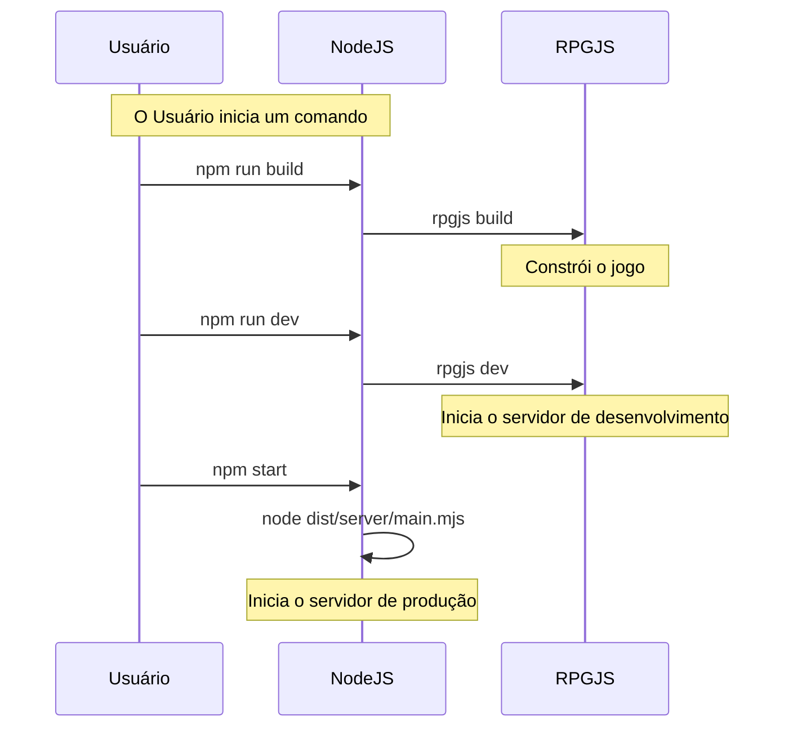
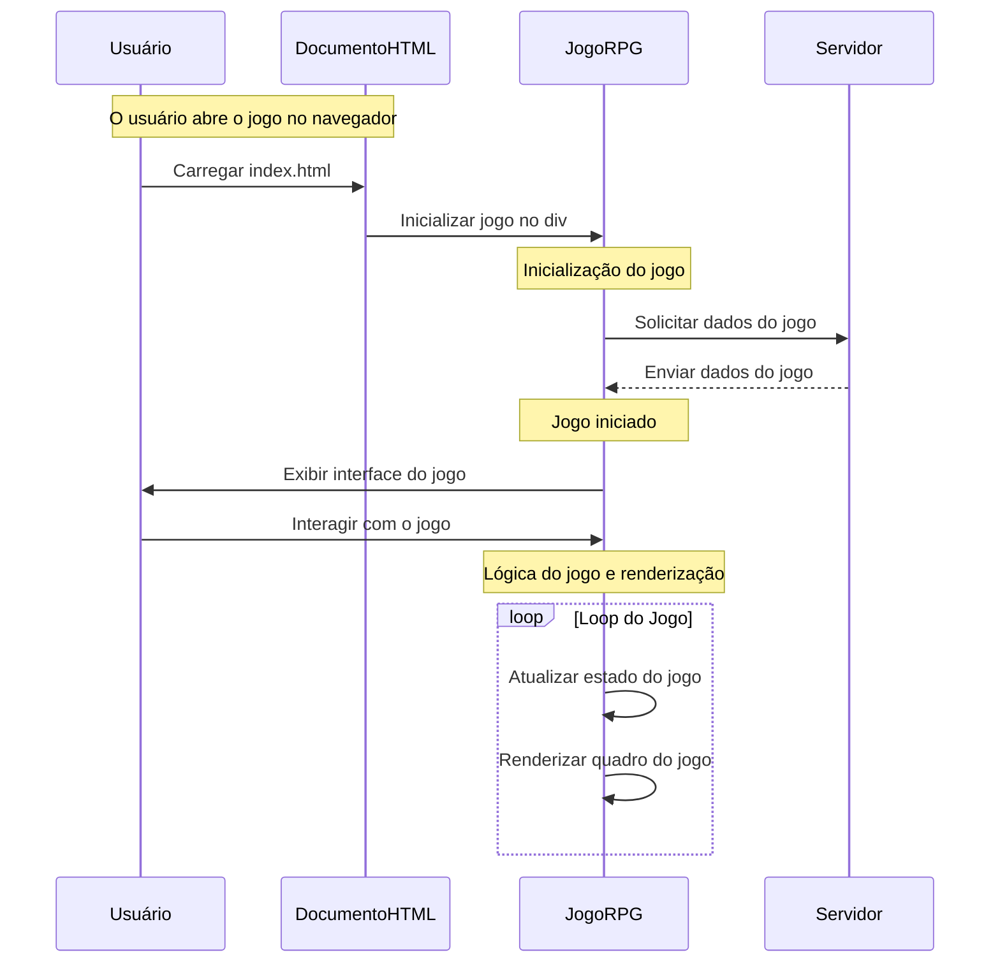

# Documentação do Projeto SoulsBrick

## Visão Geral

Este é um projeto de jogo inspirado em **Pokémon**.
um jogo MMORPG desenvolvido com RPGJS. funcionalidades incluidas escolha de companheiro, áreas de caça, encontros aleatórios.

### Comandos NPM

### Explicação do Diagrama

Este diagrama de sequência descreve o fluxo de comandos que um **usuário** executa para **compilar** e **executar** o jogo usando o framework **RPGJS**.

## Usuário executa `npm run build`:
1. O **Usuário** inicia o comando `npm run build` no **NodeJS**.
2. O **NodeJS** executa o comando `rpgjs build` (parte da ferramenta RPGJS), o que **compila o jogo** (cria os arquivos necessários para a versão final do jogo).
3. **RPGJS** constrói o jogo e gera os arquivos compilados.

## Usuário executa `npm run dev`:
1. O **Usuário** executa `npm run dev` no **NodeJS**.
2. O **NodeJS** executa o comando `rpgjs dev` para **iniciar o servidor de desenvolvimento**.
3. **RPGJS** inicia o servidor de desenvolvimento, permitindo que o jogo seja acessado no ambiente local para testes e desenvolvimento.

## Usuário executa `npm start`:
1. O **Usuário** executa o comando `npm start` no **NodeJS**.
2. O **NodeJS** executa o comando `node dist/server/main.mjs`, que **inicia o servidor de produção**.
3. Este comando inicia a versão final do servidor para o jogo, que pode ser acessada pelos jogadores na produção (no servidor real).

## Resumo:
O diagrama descreve as etapas principais de **compilação** e **execução** de um jogo usando o **RPGJS**:
- **Compilar o jogo** (`npm run build`).
- **Iniciar o servidor de desenvolvimento** (`npm run dev`).
- **Iniciar o servidor de produção** (`npm start`).

======================

# rpg.toml

Este diagrama de sequência descreve o fluxo de interação entre o **usuário**, o **navegador** e o **servidor** durante a execução de um jogo no **RPGGame**.

## Fluxo de Execução:

### 1. **Usuário abre o jogo no navegador:**
- O **usuário** abre o jogo no navegador, carregando a página `index.html`.
- O **HTMLDocument** carrega o arquivo `index.html` e inicia o jogo dentro do elemento `div#rpg`.

### 2. **Inicialização do jogo:**
- O **RPGGame** solicita dados necessários para o jogo ao **Servidor**.
- O **Servidor** envia os dados do jogo para o **RPGGame**.

### 3. **Início do jogo:**
- O **RPGGame** inicia o jogo e exibe a interface do jogo para o **usuário**.
- O **usuário** interage com o jogo por meio da interface.

### 4. **Lógica do jogo e renderização:**
- Durante o **loop do jogo**, o **RPGGame** atualiza o estado do jogo e renderiza o quadro do jogo repetidamente.
  
## Resumo:
O diagrama descreve o processo de carregamento, inicialização e execução do jogo no navegador:
1. O jogo é carregado e inicializado no **HTML**.
2. Dados do jogo são requisitados ao **Servidor** e retornam para o **RPGGame**.
3. A interface do jogo é exibida ao **usuário**, que interage com o jogo.
4. O **loop do jogo** é executado, atualizando o estado e renderizando o jogo constantemente.